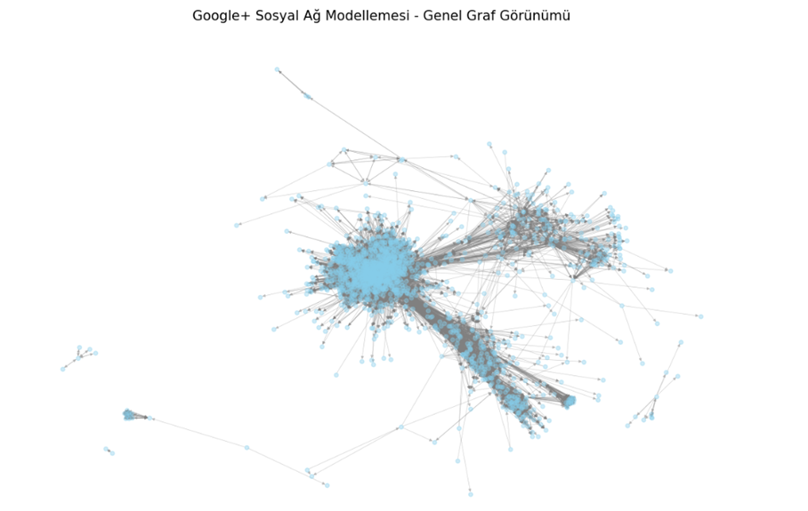
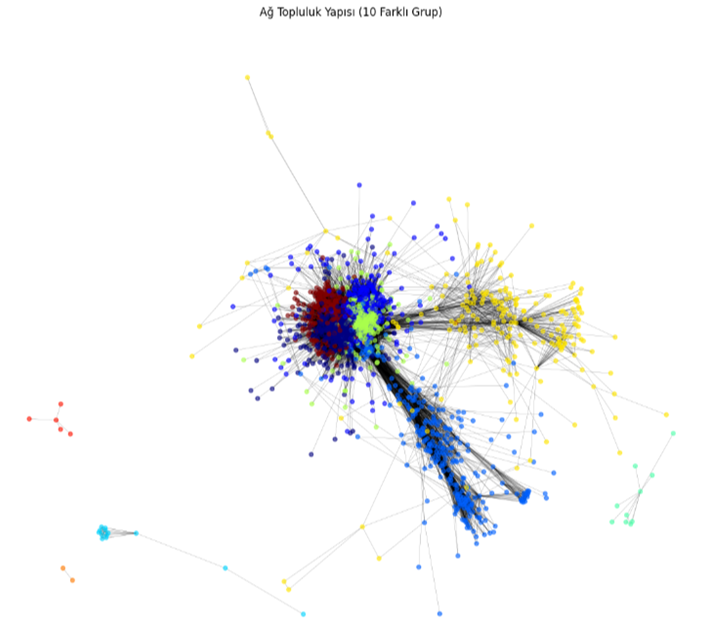

# SocialNetworkAnalysis-GooglePlus
# 🌐 Google+ Sosyal Ağ Modellemesi ve Analizi


Bu proje, **Google+** kullanıcı veri seti kullanılarak sosyal ağların yapısını, toplulukları ve kullanıcılar arası etkileşimleri incelemek amacıyla geliştirilmiştir. Ağ üzerindeki düğümler (kullanıcılar) ve ayrıtlar (bağlantılar) analiz edilerek çeşitli grafik teorisi algoritmaları uygulanmıştır.

## 🚀 Proje Amacı
Sosyal ağlardaki bilgi akışını, merkez-çevre (core-periphery) yapılarını ve topluluk kümelerini görselleştirerek analiz etmek. Özellikle **Spring Layout** algoritması kullanılarak, birbiriyle yoğun iletişimde olan alt gruplar ortaya çıkarılmıştır.

## 📊 Öne Çıkan Özellikler
- **Büyük Veri Görselleştirme:** Google+ karmaşık ağ verilerinin anlaşılır bir formata dönüştürülmesi.
- **Spring Layout Algoritması:** Çekim-itme kuvvetleri prensibiyle düğümlerin doğal kümelenmesinin haritalandırılması.
- **Merkezilik (Centrality) Analizi:** Ağdaki en etkili (hub) kullanıcıların tespit edilmesi.

## 📸 Görseller






## 💻 Kullanılan Teknolojiler
- **Programlama Dili:** Python
- **Ağ Analiz Kütüphanesi:** NetworkX
- **Veri Görselleştirme:** Matplotlib / Seaborn
- **Veri İşleme:** Pandas

## 🛠️ Kurulum ve Çalıştırma

Projeyi kendi bilgisayarınızda çalıştırmak için aşağıdaki adımları izleyebilirsiniz:

1. Depoyu klonlayın:
   ```bash
   git clone https://github.com/iremert/SocialNetworkAnalysis-GooglePlus.git
